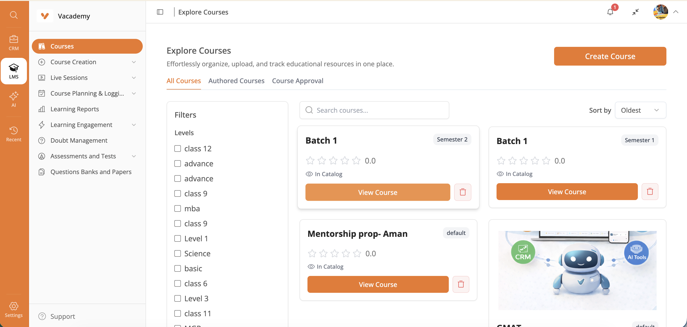
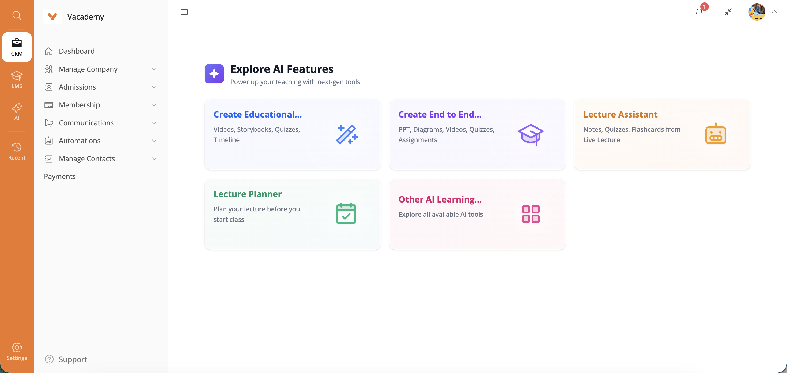
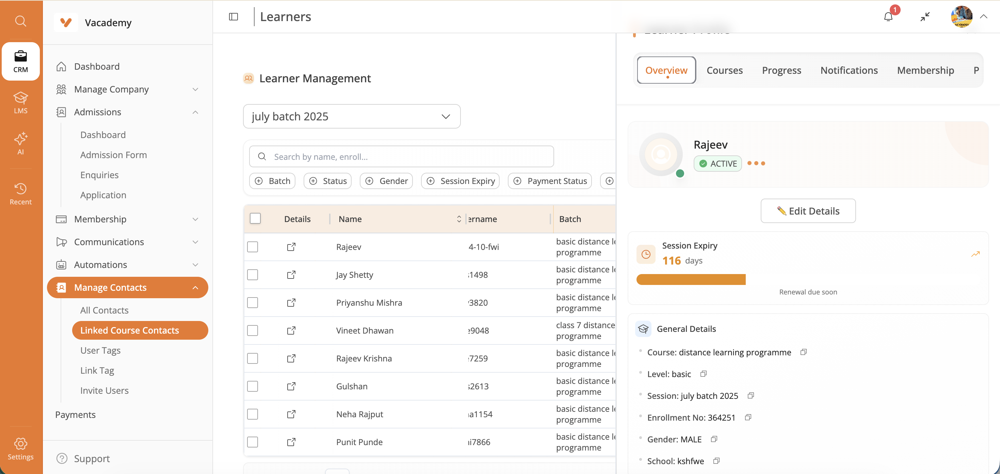
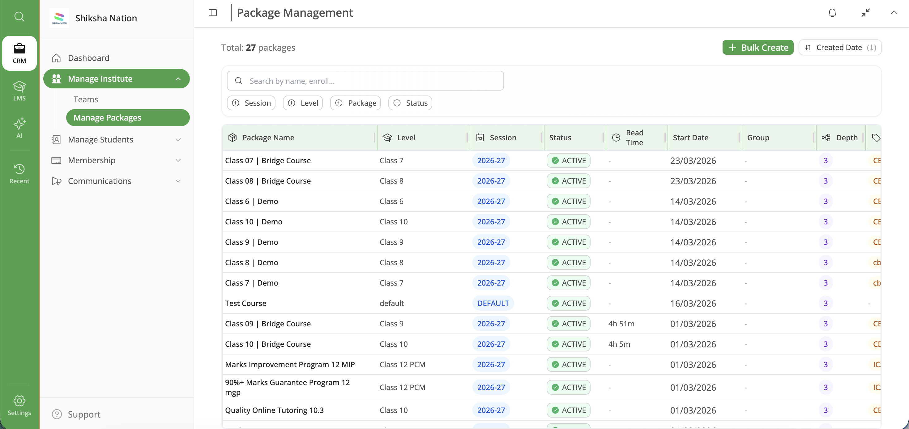
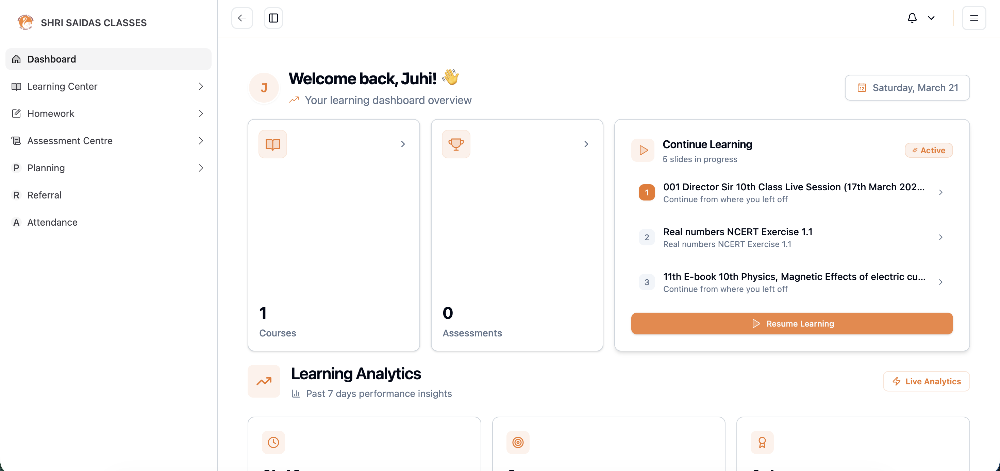
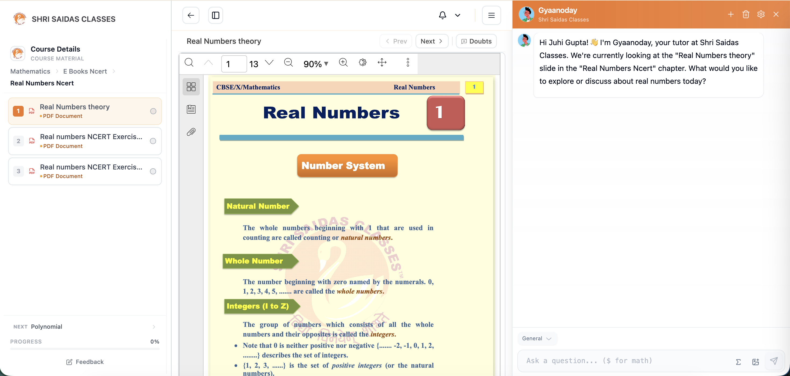
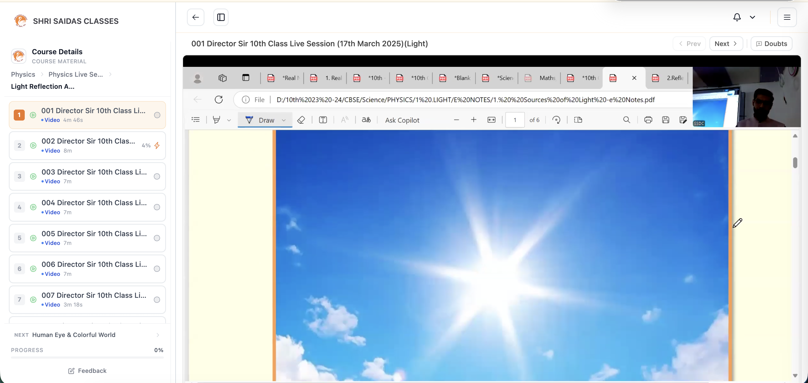

<p align="center">
  
</p>

<h3 align="center">AI-powered, open-source Learning Management System</h3>

<p align="center">
  <a href="https://www.gnu.org/licenses/agpl-3.0"></a>
  <a href="CONTRIBUTING.md"></a>
  <a href="https://deepwiki.com/Vacademy-io/vacademy_platform"></a>
</p>

<p align="center">
  <a href="https://vacademy.io"><strong>Website</strong></a> &middot;
  <a href="https://dash.vacademy.io"><strong>Admin Portal</strong></a> &middot;
  <a href="https://learner.vacademy.io"><strong>Learner Portal</strong></a> &middot;
  <a href="CONTRIBUTING.md"><strong>Contributing</strong></a>
</p>

---

## Screenshots

### Admin Portal

| Course Explorer | AI Features |
|:-:|:-:|
|  |  |

| Learner Management | Package Management |
|:-:|:-:|
|  |  |

### Learner Portal

| Dashboard | AI Chat Assistant |
|:-:|:-:|
|  |  |

| Course Viewer |
|:-:|
|  |

---

## 📚 Documentation Index

| Document | Purpose | Audience |
|----------|---------|----------|
| **[Local Development Guide](docs/deployment/LOCAL_DEVELOPMENT.md)** | Complete setup for local development | Developers |
| **[GitHub Secrets Configuration](docs/deployment/GITHUB_SECRETS.md)** | Production secrets management | DevOps/Administrators |
| **[Security Migration Summary](docs/guides/SECURITY_MIGRATION_SUMMARY.md)** | Security improvements overview | Technical Teams |
| **[Stage Properties Migration](docs/guides/STAGE_PROPERTIES_MIGRATION_UPDATE.md)** | Environment variable migration details | DevOps/Developers |

## 🚀 Quick Links

- **[🐳 Local Development Setup](#-local-development-recommended)** - Get started in 2 minutes
- **[🏗️ Architecture Overview](#️-backend-architecture--services)** - Understand the system
- **[📋 Service Access](#-service-access-points)** - Access points and APIs
- **[🎯 Frontend Applications](#frontend)** - Admin and learner dashboards

## About

Vacademy is an AI-enabled, open-source Learning Management System (LMS) built with a **microservices architecture**. It provides comprehensive tools for educational institutions, instructors, and learners, including course management, assessment creation, study libraries, and learner tracking.

The platform features a robust backend powered by **Spring Boot microservices** and modern frontend applications built with **React**, ensuring scalability, flexibility, and maintainability while delivering a powerful educational experience.

### 🎯 Key Highlights

- **6 Microservices** with dedicated databases and specialized functions
- **Docker Compose** for seamless local development  
- **Kubernetes/Helm** for production deployment
- **GitHub Actions** CI/CD with automated testing
- **Environment Variable** based configuration management
- **OAuth2 Integration** (Google, GitHub)
- **AI-Powered Features** (VSmart tools)
- **Multi-Channel Notifications** (Email, WhatsApp, Push)

## Features in Depth

### Course Management
- **Course Creation and Organization**: Create and organize courses with levels, subjects, modules, chapters, and slides.
- **Study Library**: Centralized repository for all educational content.
- **Document Management**: Upload, organize, and share educational documents in folder structures.

### User Management
- **Institute Management**: Create and manage educational institutions.
- **Batch Management**: Organize learners into batches for effective administration.
- **Faculty Management**: Manage faculty members and teaching staff.
- **Student Management**: Comprehensive tools for student enrollment, tracking, and management.
- **CSV Bulk Import**: Import students in bulk using CSV files.

### Assessment System
- **Assessment Creation**: Create various types of assessments and examinations.
- **Question Paper Management**: Design and manage question papers.
- **Live Testing**: Support for real-time examinations.
- **Homework Management**: Create and assign homework to learners.
- **AI-Powered Evaluation**: Automated assessment grading using AI.

### Learner Experience
- **Learner Dashboard**: Personalized dashboard for learners to access courses and track progress.
- **Study Materials**: Access to course materials, presentations, and documents.
- **Assessment Participation**: Take tests, exams, and complete homework assignments.
- **Progress Tracking**: Detailed progress reports and performance analytics.

### AI Features
- **VSmart Audio**: AI-powered audio processing tools.
- **VSmart Chat**: Intelligent chatbot assistance.
- **VSmart Extract**: Automatic extraction of information from documents.
- **VSmart Feedback**: AI-generated feedback on assessments.

### Presentation Mode
- **Interactive Presentations**: Create and deliver interactive course presentations.
- **Presenter Controls**: Advanced controls for presenters during live sessions.
- **Learner Participation**: Interactive features for learners during presentations.

### Reporting and Analytics
- **Learner Reports**: Comprehensive reports on learner performance.
- **Batch Reports**: Aggregate reports for batches of students.
- **Export Functionality**: Export reports in various formats.
- **Notification Settings**: Configure report notification preferences.

### Learner Tracking
- **Activity Logging**: Detailed tracking of learner activities.
- **Progress Monitoring**: Monitor individual and group progress through courses.
- **Engagement Metrics**: Measure student engagement with various course materials.

## Tech Stack

### Backend
- **Java 17**: Primary programming language.
- **Spring Boot**: Framework for building microservices.
- **Maven**: Dependency management and build tool.
- **PostgreSQL**: Primary database system.
- **AWS S3**: Cloud storage for media files.
- **Kubernetes**: Container orchestration for deployment.

### Frontend
- **React 18+**: JavaScript library for building user interfaces.
- **TypeScript**: Type-safe JavaScript.
- **Vite**: Next-generation frontend tooling.
- **TanStack Router**: Modern routing library.
- **TanStack Query**: Data fetching and state management.
- **TanStack Table**: Table UI components.
- **Radix UI**: Unstyled, accessible UI components.
- **Tailwind CSS**: Utility-first CSS framework.
- **Capacitor**: For mobile app development (learner dashboard).

### Tools & Utilities
- **Docker**: Containerization platform.
- **Swagger UI**: API documentation.
- **GitHub Actions**: CI/CD automation.
- **Storybook**: UI component development environment (admin dashboard).

## 🏗️ Backend Architecture & Services

The Vacademy platform uses a **microservices architecture** with 6 specialized services, each running on dedicated ports and databases for optimal scalability and maintainability.

### Service Overview

| Service | Port | Database | Primary Functions |
|---------|------|----------|-------------------|
| **Auth Service** | 8071 | `auth_service` | Authentication, authorization, OAuth integration |
| **Admin Core Service** | 8072 | `admin_core_service` | Course management, admin operations |
| **Community Service** | 8073 | `community_service` | Community features, user interactions |
| **Assessment Service** | 8074 | `assessment_service` | Testing, evaluation, reports |
| **Media Service** | 8075 | `media_service` | File storage, media processing |
| **Notification Service** | 8076 | `notification_service` | Notifications, email, WhatsApp |

### Service Details

#### **Common Service**
- Shared utilities, models, and configurations
- Base classes and common functionality
- Cross-service dependencies and interfaces

#### **Auth Service** (Port 8071)
- User authentication and authorization
- OAuth2 integration (Google, GitHub)
- JWT token management
- Session handling and security

#### **Admin Core Service** (Port 8072)
- Course, module, subject, and chapter management
- Slide creation and presentation tools
- Learner invitation and enrollment
- Institute and faculty management
- Study library organization
- Administrative dashboard operations

#### **Media Service** (Port 8075)
- File upload and storage (AWS S3 integration)
- Media processing and optimization
- AI-powered content analysis
- Document management and organization

#### **Community Service** (Port 8073)
- User interaction and community features
- Discussion forums and collaboration tools
- Social learning components

#### **Assessment Service** (Port 8074)
- Assessment creation and scheduling
- Question paper management
- Live testing and evaluation
- Automated grading and feedback
- Performance analytics and reporting

#### **Notification Service** (Port 8076)
- Multi-channel notifications (email, push, WhatsApp)
- AWS SES integration for email delivery
- Event-driven notification system
- Communication preferences management

### **Deployment Architecture**

#### **Local Development**
- **Docker Compose** orchestrates all services
- **PostgreSQL** with separate databases per service
- **Redis** for caching and session storage
- **Nginx** gateway for request routing

#### **Production Deployment**
- **Kubernetes** cluster with Helm charts
- **AWS ECR** for container registry
- **RDS PostgreSQL** for managed databases
- **Application Load Balancer** for traffic distribution
- **GitHub Actions** for CI/CD automation

## 🚀 Quick Start & Installation

### Prerequisites
Before installing Vacademy, ensure you have:
- **Docker** and **Docker Compose** 4.0+ (recommended for local development)
- **GitHub Personal Access Token** with package read permissions
- **Java 17** and **Maven 3.8+** (optional, for building from source)
- **Kubernetes cluster** (for production deployment)

> **Note**: The GitHub token is required for accessing shared dependencies in GitHub packages. [Create a token here](https://github.com/settings/tokens) with `read:packages` permission.

### 🐳 Local Development (Recommended)

**🚀 One-Command Setup:**
```bash
# Clone and setup (2 minutes total)
git clone https://github.com/Vacademy-io/vacademy_platform.git
cd vacademy_platform
chmod +x scripts/local-dev-setup.sh
./scripts/local-dev-setup.sh
```

**What the script does automatically:**
- ✅ Validates system requirements (Docker, ports)
- ✅ Sets up all 6 microservices with Docker Compose
- ✅ Configures PostgreSQL with separate databases per service
- ✅ Sets up Redis for caching and sessions
- ✅ Configures Nginx gateway for service routing
- ✅ Performs comprehensive health checks
- ✅ Provides service status and access URLs

**Manual Docker Compose Setup:**
```bash
# 1. Clone the repository
git clone https://github.com/Vacademy-io/vacademy_platform.git
cd vacademy_platform

# 2. Start all services
docker-compose up -d

# 3. Check service status
docker-compose ps

# 4. View logs
docker-compose logs -f
```

**Access Points:**
- **Gateway**: http://localhost (Nginx routing to all services)
- **Individual Services**: http://localhost:807X (where X = 1-6)
- **Swagger UI**: Interactive API documentation at each service endpoint
- **Service Health**: `/actuator/health` endpoint on each service

### 🏗️ Production Deployment

**Kubernetes with Helm:**
```bash
# Deploy to Kubernetes cluster
helm install vacademy ./vacademy_devops/vacademy-services

# Update deployment
helm upgrade vacademy ./vacademy_devops/vacademy-services
```

**GitHub Actions CI/CD:**
- Automated deployment triggered on push to main branch
- Environment variables managed through GitHub Secrets
- ECR container registry integration
- Multi-environment support (staging/production)

### 🔧 Configuration Management

**Environment Variables:**
All sensitive configuration is managed through environment variables:
- **Local Development**: Automatic setup with safe defaults
- **Production**: GitHub Secrets integration for secure deployment

**Key Configuration Areas:**
- Database connections (PostgreSQL per service)
- Service-to-service communication URLs
- OAuth credentials (Google, GitHub)
- AWS S3 storage configuration
- Email and notification settings
- External API keys (OpenAI, Gemini, YouTube, etc.)

### 📚 Documentation References

For detailed setup and configuration, see:
- **[Local Development Guide](docs/deployment/LOCAL_DEVELOPMENT.md)** - Complete local setup instructions
- **[GitHub Secrets Configuration](docs/deployment/GITHUB_SECRETS.md)** - Production secrets management
- **[Security Migration Summary](docs/guides/SECURITY_MIGRATION_SUMMARY.md)** - Security improvements overview
- **[Stage Properties Migration](docs/guides/STAGE_PROPERTIES_MIGRATION_UPDATE.md)** - Environment variable migration details

## 📁 Monorepo Structure

```
vacademy_platform/
├── frontend-admin-dashboard/       # Admin dashboard (React + Vite + TanStack)
├── frontend-learner-dashboard-app/ # Learner dashboard (React + Vite + Capacitor)
├── admin_core_service/             # Course management, admin operations
├── ai_service/                     # AI-powered features (Python)
├── assessment_service/             # Testing, evaluation, reports
├── auth_service/                   # Authentication, OAuth2
├── common_service/                 # Shared utilities and models
├── community_service/              # Community features
├── media_service/                  # File storage, media processing
├── notification_service/           # Email, WhatsApp, push notifications
├── engage-client/                  # Engagement client
├── docs/                           # Documentation
│   ├── deployment/                 # Setup & deployment guides
│   ├── guides/                     # Feature & integration guides
│   ├── sentry/                     # Observability & logging docs
│   └── jumpstart/                  # Jumpstart program docs
├── scripts/                        # Dev & deployment scripts
│   ├── db/                         # Database setup SQL
│   └── k8s/                        # Kubernetes scripts
├── vacademy_devops/                # Helm charts & DevOps config
├── docker-compose.yml              # Local development orchestration
├── pom.xml                         # Maven parent POM
└── Dockerfile
```

## 📋 Service Access Points

### Local Development URLs

| Service | Direct URL | Gateway URL | API Documentation |
|---------|------------|-------------|-------------------|
| **Gateway** | - | http://localhost | - |
| **Auth Service** | http://localhost:8071 | http://localhost/auth-service/ | [Swagger](http://localhost:8071/auth-service/swagger-ui.html) |
| **Admin Core** | http://localhost:8072 | http://localhost/admin-core-service/ | [Swagger](http://localhost:8072/admin-core-service/swagger-ui.html) |
| **Community** | http://localhost:8073 | http://localhost/community-service/ | [Swagger](http://localhost:8073/community-service/swagger-ui.html) |
| **Assessment** | http://localhost:8074 | http://localhost/assessment-service/ | [Swagger](http://localhost:8074/assessment-service/swagger-ui.html) |
| **Media** | http://localhost:8075 | http://localhost/media-service/ | [Swagger](http://localhost:8075/media-service/swagger-ui.html) |
| **Notification** | http://localhost:8076 | http://localhost/notification-service/ | [Swagger](http://localhost:8076/notification-service/swagger-ui.html) |

### Health Check Endpoints

```bash
# Check individual service health
curl http://localhost:8071/auth-service/actuator/health
curl http://localhost:8072/admin-core-service/actuator/health
# ... (repeat for each service)

# Check all services via gateway
curl http://localhost/health
```

### Development Tools

- **Database Access**: PostgreSQL at `localhost:5432` with separate databases per service
- **Cache**: Redis at `localhost:6379`
- **Log Monitoring**: `docker-compose logs -f [service-name]`
- **Service Scaling**: `docker-compose up -d --scale [service-name]=3`

### 🎯 Frontend Applications

The platform includes two React applications with TypeScript:

#### **Learner Dashboard** (Mobile-First)
```bash
cd frontend-learner-dashboard-app
npm install && npm run dev
```
- **Purpose**: Student interface for courses, assessments, progress tracking
- **Features**: Responsive design, mobile app capabilities (Capacitor)
- **Access**: Typically runs on http://localhost:3000

#### **Admin Dashboard** (Desktop-Focused)  
```bash
cd frontend-admin-dashboard
npm install && npm run dev
```
- **Purpose**: Administrative interface for course management, analytics
- **Features**: Advanced tools, reporting, presentation mode
- **Access**: Typically runs on http://localhost:3001

> **Note**: Frontend development is optional for backend-focused development. The Docker Compose setup focuses on backend services.

## Frontend

The Vacademy platform features two distinct frontend applications:

### Learner Dashboard
A responsive, mobile-first application designed for learners to access educational content and participate in assessments.

**Key Features:**
- Responsive design with Capacitor for mobile app capabilities.
- Course library access and navigation.
- Assessment participation.
- Progress tracking.
- Notification system.
- Multi-language support.

**Tech Stack:**
- React with TypeScript
- Vite for building and bundling
- TanStack Router for navigation
- TanStack Query for data fetching
- Capacitor for cross-platform mobile capabilities
- Tailwind CSS for styling

### Admin Dashboard
A comprehensive administration interface for educational institutions and instructors.

**Key Features:**
- Course creation and management.
- Assessment design and evaluation.
- Student management.
- Reports and analytics.
- AI-powered tools for content creation and evaluation.
- Presentation mode for interactive teaching.

**Tech Stack:**
- React with TypeScript
- Vite for building and bundling
- TanStack Router for navigation
- TanStack Query for data fetching
- Storybook for component development
- Tailwind CSS for styling

## Routes

### Learner Dashboard Routes
- **Authentication**
  - `/login`: User login
  - `/register`: New user registration
  - `/login/forgot-password`: Password recovery
  - `/logout`: User logout
- **Dashboard**
  - `/dashboard`: Main user dashboard
  - `/dashboard/notifications`: User notifications
- **Study Library**
  - `/study-library`: Main study library
  - `/study-library/courses`: Course listing
  - `/study-library/courses/levels`: Level selection
  - `/study-library/courses/levels/subjects`: Subject selection
  - `/study-library/courses/levels/subjects/modules`: Module selection
  - `/study-library/courses/levels/subjects/modules/chapters`: Chapter selection
  - `/study-library/courses/levels/subjects/modules/chapters/slides`: Slide viewer
- **Assessment**
  - `/assessment/examination`: Available examinations
  - `/assessment/examination/$assessmentId`: Assessment details
  - `/assessment/examination/$assessmentId/LearnerLiveTest`: Take live assessment
  - `/assessment/examination/$assessmentId/assessmentPreview`: Preview assessment
  - `/assessment/reports/student-report`: Student assessment reports
- **User Management**
  - `/user-profile`: User profile view
  - `/user-profile/edit`: Edit user profile
  - `/delete-user`: Delete user account
  - `/institute-selection`: Select learning institute
  - `/learner-invitation-response`: Respond to institute invitations

### Admin Dashboard Routes
- **Authentication**
  - `/login`: Admin login
  - `/signup`: New admin registration
  - `/login/forgot-password`: Password recovery
- **Dashboard**
  - `/dashboard`: Main admin dashboard
- **Study Library Management**
  - `/study-library`: Main study library management
  - `/study-library/courses`: Course management
  - `/study-library/present`: Presentation mode
  - `/study-library/reports`: Study library reports
- **Assessment Management**
  - `/assessment/assessment-list`: List of assessments
  - `/assessment/question-papers`: Question paper management
- **Evaluation Tools**
  - `/evaluation/evaluation-tool`: Evaluation tools
  - `/evaluation/evaluations`: Evaluation management
- **AI Center**
  - `/ai-center/ai-tools`: AI tool selection
  - `/ai-center/ai-tools/vsmart-audio`: AI audio processing
  - `/ai-center/ai-tools/vsmart-chat`: AI chatbot interface
  - `/ai-center/ai-tools/vsmart-extract`: AI content extraction
  - `/ai-center/ai-tools/vsmart-feedback`: AI assessment feedback
- **Institute Management**
  - `/manage-institute/batches`: Batch management
  - `/manage-institute/sessions`: Session management
  - `/manage-institute/teams`: Team management
- **Student Management**
  - `/manage-students/students-list`: Student listing
  - `/manage-students/invite`: Invite students
  - `/manage-students/enroll-requests`: Manage enrollment requests


## 🚀 Deployment & Operations

### **Local Development**
- **One-command setup** with `./scripts/local-dev-setup.sh`
- **Docker Compose** orchestration for all services
- **Automatic database setup** with separate schemas per service
- **Hot reload** and easy debugging capabilities

### **Production Deployment**
- **Kubernetes/Helm** charts for scalable deployment
- **GitHub Actions** CI/CD with automated testing and deployment
- **Environment-based configuration** through GitHub Secrets
- **Multi-environment support** (staging, production)

### **Security & Configuration**
- **38 GitHub Secrets** for secure configuration management
- **Environment variable** based configuration (no hardcoded values)
- **OAuth2 integration** for secure authentication
- **Automated secret injection** in deployment workflows

## 📝 Contributing

We welcome contributions! Here's how to get started:

1. **Fork the repository** and clone locally
2. **Set up local development** using our Docker Compose setup
3. **Create a feature branch** for your changes
4. **Test thoroughly** using provided health checks and test suites
5. **Submit a pull request** with detailed description

### **Development Guidelines**
- Follow existing code patterns and naming conventions
- Add tests for new functionality
- Update documentation as needed
- Ensure all services pass health checks
- Test both local and containerized environments

## 📞 Support & Resources

### **Getting Help**
- **Issues**: Use GitHub Issues for bug reports and feature requests
- **Discussions**: Join our community discussions for questions
- **Documentation**: Comprehensive guides in the `/docs` folder

### **Key Resources**
- **[Local Development Guide](docs/deployment/LOCAL_DEVELOPMENT.md)** - Complete setup instructions
- **[API Documentation](http://localhost/swagger-ui.html)** - Interactive API docs (when running locally)
- **[Architecture Docs](docs/guides/SECURITY_MIGRATION_SUMMARY.md)** - System design and security
- **[Deployment Guide](docs/deployment/GITHUB_SECRETS.md)** - Production deployment instructions

---

## 📋 System Requirements

### **For Local Development**
- **Docker Desktop** 4.0+ (8GB RAM recommended)
- **Git** for version control
- **Modern browser** for accessing web interfaces

### **For Production Deployment**
- **Kubernetes cluster** (EKS, GKE, or similar)
- **PostgreSQL** database (RDS recommended)
- **AWS S3** for file storage
- **GitHub repository** with Actions enabled

### **Optional Tools**
- **kubectl** for Kubernetes management
- **helm** for chart deployment
- **Java 17 + Maven** for building from source
- **Node.js 18+** for frontend development

---

---

## 🎯 What Makes Vacademy Special?

✨ **Modern Architecture**: 6 microservices with dedicated databases  
🐳 **Developer Friendly**: One-command setup with Docker Compose  
🔒 **Enterprise Security**: GitHub Secrets + environment variable management  
🚀 **Production Ready**: Kubernetes/Helm deployment with CI/CD  
🤖 **AI-Powered**: VSmart tools for intelligent learning experiences  
🌐 **Multi-Platform**: Web + mobile apps for learners and administrators  

**🎉 Ready to transform education with AI-powered learning?**  
**Start here: [Local Development Guide](docs/deployment/LOCAL_DEVELOPMENT.md) → Get running in 2 minutes!**

---

*Built with ❤️ by the Vacademy community • [Contribute](https://github.com/Vacademy-io/vacademy_platform) • [Report Issues](https://github.com/Vacademy-io/vacademy_platform/issues) • [Join Discussions](https://github.com/Vacademy-io/vacademy_platform/discussions)*
